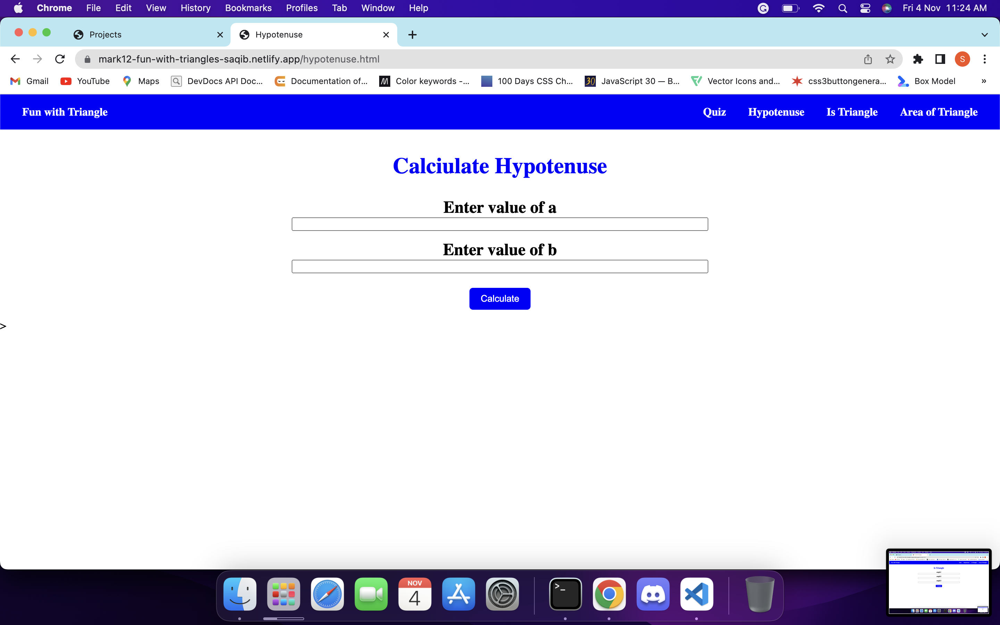
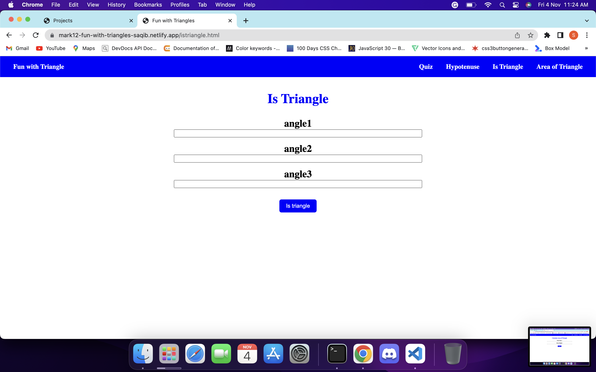
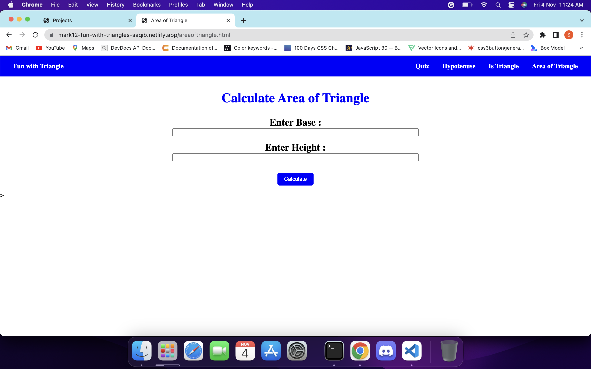

# Mark12-Fun-With-Triangles

In this app, you will find four tabs on triangle topic.

1. Quiz : In this option, there is small quiz on very basics on triangles. you can select right options and check your answer.

2. Is Triangle: It will ask you three angles as input and tell you whether it forms triangle or not.

3. Area of Triangle : In which you give height and base as inputs and it will tell you the area of triangle.

## Technologies i used to build this:

1. HTML
2. CSS
3. JavaScript

## Project is live, to check [click here](https://mark12-fun-with-triangles-saqib.netlify.app/ "Fun-with-traingles")

## Image

